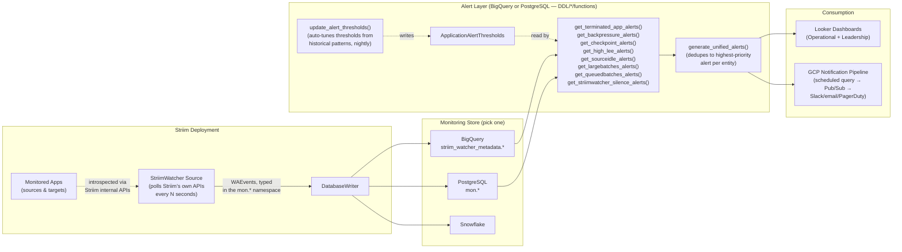

# StriimWatcher — Monitoring & Alerting Architecture

This document ties together the pieces of this repo into one picture: how telemetry flows out of
Striim, how it becomes alerts, how to build dashboards on it, and how to wire those alerts into
GCP-native notifications. Each section below points at the runnable content that backs it up.

---

## 1. High-Level Observability & Data-Flow Architecture



**The flow, in words:**

1. **StriimWatcher** (this module) runs as a Striim *source*. On a schedule (5 minutes by
   default), it polls Striim's own monitoring APIs — application status, event counts, latency,
   checkpoint/recovery state, server logs and Smart Alerts, system config, and more — and emits
   each as a typed `WAEvent` in the `mon` namespace.
2. A `DatabaseWriter` lands those events into `striim_mon_*` tables in your monitoring store —
   BigQuery, PostgreSQL, or Snowflake (`DDL/BigQuery`, `DDL/PostgreSQL`, `DDL/Snowflake`).
3. A set of **detector functions** (`DDL/<dialect>/functions/get_*_alerts.sql`) scan that recent
   history for eight problem conditions — terminated apps, backpressure, stalled checkpoints, high
   latency, idle sources, oversized/queued batches, and StriimWatcher itself going silent — each
   gated by a per-app threshold in `ApplicationAlertThresholds`.
4. **`generate_unified_alerts()`** calls all eight, keeps only the highest-priority alert per
   entity, and suppresses everything else for a cluster whose StriimWatcher has itself gone
   silent (no point alerting on one app's backpressure if the whole cluster stopped reporting).
   This is the one function most integrations should query.
5. **`update_alert_thresholds()`** runs on a schedule (e.g. nightly) to auto-tune thresholds from
   each app's actual historical behavior, so alerting stays useful as usage patterns change.
   Manual overrides (`tune_alert_thresholds()`) and per-app enable/disable (`toggle_alert()`) are
   also available — see `DDL/BigQuery/functions/README.md`.
6. From there, the same tables feed two consumption paths: **dashboards** (§3/§5) and
   **notifications** (§4).

---

## 2. StriimWatcher TQL Samples

Runnable pipeline examples live in [`examples/`](examples/), one self-contained folder per use
case (pipeline `app.tql` + `README.md` + the companion Postgres DDL/seed files):

| Sample | What it shows |
|---|---|
| [`node-health-to-postgres`](examples/node-health-to-postgres/) | Minimal node-health telemetry — the starting point. No companion app needed. |
| [`app-detail-monitoring`](examples/app-detail-monitoring/) | Per-application detail scoped to one app via `AppNameFilter`. |
| [`table-comparison-sli`](examples/table-comparison-sli/) | Source-vs-target event-count comparison and since-last-interval (SLI) deltas. |

See [`examples/README.md`](examples/README.md) for the full catalog, a "goal → sample" lookup
table, and what's intentionally not shipped as a runnable example (on-prem-only log/API paths).

[`tql/admin.ApplicationScheduler.tql`](tql/admin.ApplicationScheduler.tql) is a standalone utility
pipeline for starting/stopping a fixed list of applications on a schedule — independent of
StriimWatcher itself, but commonly deployed alongside it to bound when monitored apps run.

---

## 3. BigQuery-Based Dashboarding Queries

The full set of dashboard-ready BigQuery views and table functions lives in
[`DDL/BigQuery/Looker/`](DDL/BigQuery/Looker/), organized around two dashboards:

- **Operational Dashboard** — real-time ops view: CPU per app, app failure list/drilldown,
  backpressure/checkpoint health, batch processing, files open, WARN-level alert history. See
  [`OPERATIONAL_DASHBOARD.md`](DDL/BigQuery/Looker/OPERATIONAL_DASHBOARD.md).
- **Leadership Dashboard** — trend view: alert frequency over time, throughput trends, lag with a
  rolling average, cumulative data-flow rates. See
  [`LEADERSHIP_DASHBOARD.md`](DDL/BigQuery/Looker/LEADERSHIP_DASHBOARD.md).

[`QUERY_EXAMPLES.md`](DDL/BigQuery/Looker/QUERY_EXAMPLES.md) has copy-paste SQL for testing each
query directly in BigQuery before wiring it into Looker; [`LOOKML_EXAMPLES.md`](DDL/BigQuery/Looker/LOOKML_EXAMPLES.md)
has the corresponding LookML model/view/explore definitions. Start with
[`DDL/BigQuery/Looker/README.md`](DDL/BigQuery/Looker/README.md) for the data model and deployment
order.

---

## 4. GCP-Based Alarm Notification Examples

**Recommended notification pattern.** BigQuery scheduled queries can't call external services
directly, so the standard GCP wiring is:

```
BigQuery scheduled query          Cloud Function            Notification
(runs generate_unified_alerts  →  (triggered on new    →    (Pub/Sub → Slack
 or a condition query below,       rows, e.g. via a          webhook / email /
 appends new rows to an            Pub/Sub notification      PagerDuty via its
 alerts_log table)                 from the scheduled        own Pub/Sub or
                                    query, or a short-        webhook integration)
                                    interval poll)
```

1. Create a destination table, e.g. `striim_watcher_metadata.alerts_log`, with the same columns as
   `generate_unified_alerts()`'s output plus a `notified_at TIMESTAMP` column.
2. Schedule a query (BigQuery UI → **Scheduled Queries**, every 5 minutes to match StriimWatcher's
   default polling interval) that runs `INSERT INTO alerts_log SELECT *, NULL FROM
   `striim_watcher_metadata.generate_unified_alerts`(60) WHERE alert_trigger_time > (SELECT
   MAX(alert_trigger_time) FROM alerts_log)` — condition it on your dedup needs.
3. Point that scheduled query's built-in **"Send email notifications"** option at your team, or —
   for richer routing (Slack, PagerDuty) — enable **Pub/Sub notifications on the scheduled query**
   and have a small Cloud Function subscribe, format the row, and forward it to your webhook.

The same pattern applies to each of the five conditions below; each gives the detection SQL to run
on a schedule (either via the existing detector function, or — where there isn't a dedicated one
yet — an example query in the same style).

### High lag
Already a first-class detector: **`get_high_lee_alerts()`** → `alert_type = 'HIGH_AVG_LEE'`. Fires
when a source→target pair's average end-to-end latency exceeds `avgLeeThresholdMinutes`
continuously. No new query needed — schedule off `generate_unified_alerts()` directly.

### Idle source
Already a first-class detector: **`get_sourceidle_alerts()`** → `alert_type = 'SOURCE_IDLE'`.
Fires on a WARN-level `Source_Idle` Smart Alert log entry whose idle duration exceeds
`sourceInactivityThresholdMinutes`.

### Idle target
StriimWatcher emits the same Smart Alert mechanism for targets (`Target_Idle`), but there is no
dedicated detector function yet — it's the identical pattern as `get_sourceidle_alerts()` with the
message prefix swapped:

```sql
-- Example: adapt get_sourceidle_alerts.sql, changing only the message filter:
-- WHERE slw.contextbuffertext LIKE 'Source_Idle%'   -- existing
-- WHERE slw.contextbuffertext LIKE 'Target_Idle%'   -- target-idle variant
SELECT
  slw.appName,
  slw.log_date,
  SAFE_CAST(REGEXP_EXTRACT(slw.contextbuffertext, r'last\s+([0-9]+\.?[0-9]*)\s+seconds') AS FLOAT64) / 60.0 AS idle_minutes
FROM `striim_watcher_metadata.striim_mon_log_watcher` AS slw
WHERE UPPER(TRIM(slw.log_level)) = 'WARN'
  AND slw.contextbuffertext LIKE 'Target_Idle%'
  AND slw.batchdate >= TIMESTAMP_SUB(CURRENT_TIMESTAMP(), INTERVAL 5 DAY)
ORDER BY slw.batchdate DESC;
```

Promote this to a real `get_targetidle_alerts()` table function (copy
`DDL/BigQuery/functions/get_sourceidle_alerts.sql` and swap the filter) if you want it folded into
`generate_unified_alerts()`.

### Zero events for more than 5 minutes
`totalInput`/`totalOutput` in `striim_mon_appdetail` are cumulative counters (same numbers shown
in the Striim UI), so "zero events" means the counter hasn't moved between consecutive polls for
a `RUNNING` app — the same consecutive-state "spell" pattern used by the existing detectors:

```sql
WITH OutputHistory AS (
  SELECT
    appName, batchdate, totalOutput, appStatus,
    LAG(totalOutput) OVER (PARTITION BY appName ORDER BY batchdate) AS prev_totalOutput,
    LAG(batchdate) OVER (PARTITION BY appName ORDER BY batchdate) AS prev_batchdate
  FROM `striim_watcher_metadata.striim_mon_appdetail`
  WHERE batchdate >= TIMESTAMP_SUB(CURRENT_TIMESTAMP(), INTERVAL 1 DAY)
)
SELECT appName, batchdate,
  TIMESTAMP_DIFF(batchdate, prev_batchdate, MINUTE) AS minutes_with_no_new_events
FROM OutputHistory
WHERE UPPER(TRIM(appStatus)) = 'RUNNING'
  AND totalOutput = prev_totalOutput
  AND TIMESTAMP_DIFF(batchdate, prev_batchdate, MINUTE) >= 5;
```

### Large PK updates
`striim_mon_table_comparison` tracks primary-key updates per interval
(`diffNumOfPkupdates` = source vs. target PK-update delta since the last poll). Pick a threshold
appropriate to your workload (example below uses 10,000 in one interval):

```sql
SELECT
  appName, sourceName, targetName, batchdate,
  srcNumOfPkupdates, tgtNumOfPkupdates, diffNumOfPkupdates
FROM `striim_watcher_metadata.striim_mon_table_comparison`
WHERE batchdate >= TIMESTAMP_SUB(CURRENT_TIMESTAMP(), INTERVAL 1 DAY)
  AND ABS(diffNumOfPkupdates) >= 10000
ORDER BY batchdate DESC;
```

---

## 5. Sample Monitoring Dashboard Views

This repo does not ship dashboard screenshots — there is no rendered-image asset to point to.
What it does ship is a tile-by-tile description of both shipped dashboards, detailed enough to
rebuild them in Looker (or any BI tool pointed at the same views/functions):

- [`DDL/BigQuery/Looker/OPERATIONAL_DASHBOARD.md`](DDL/BigQuery/Looker/OPERATIONAL_DASHBOARD.md) —
  per-tile: which query backs it, its columns, and the recommended chart type/filters (e.g. CPU
  Usage Per App as a descending bar chart, App Failure List as a table with a `days_back` filter).
- [`DDL/BigQuery/Looker/LEADERSHIP_DASHBOARD.md`](DDL/BigQuery/Looker/LEADERSHIP_DASHBOARD.md) —
  same treatment for the trend-oriented tiles.
- [`DDL/BigQuery/Looker/DASHBOARD_EXPANSION_RECOMMENDATIONS.md`](DDL/BigQuery/Looker/DASHBOARD_EXPANSION_RECOMMENDATIONS.md)
  — additional tiles considered but not yet built, if you want to extend either dashboard.

If you build these out in Looker and want actual screenshots in this repo for a future customer
handoff, add them under an `images/` folder and link them from the relevant dashboard doc above.
